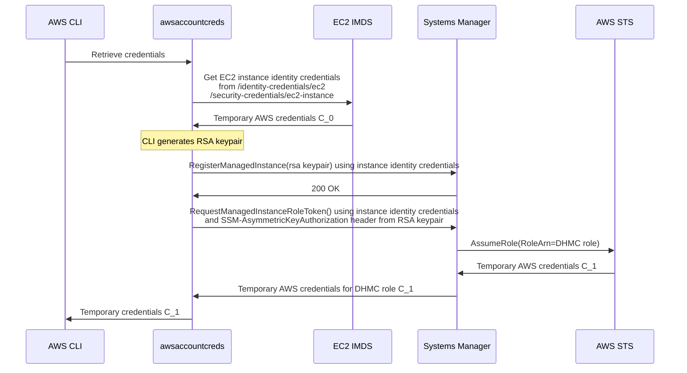

This is an AWS [`credential_process` credential provider][cred-process] that 
sources credentials from AWS Systems Manager's [Default Host Management Configuration][dhmc]. 
It allows an EC2 instance to assume a role **without an associated instance profile**.

This project is just a PoC. It uses a lot of code copy-pasted directly from the 
Amazon SSM agent GitHub repo. Don't use this for anything beyond education.

## Usage

* Follow the [AWS docs][dhmc] on setting up DHMC in your account. Note that it is
  a region-specific setting.
* Launch an EC2 instance without an associated instance profile (IAM role) 
* Install `awsaccountcreds`
* Write the following to `~/.aws/config`:
  
  ```
  [default]
  credential_process = /home/ec2-user/awsaccountcreds # or wherever you placed the executable
  ```
* Run something in the AWS CLI, like `aws sts get-caller-identity` or (if the DHMC
  role has S3 permissions) `aws s3 ls`.

## How it works

See the following sequence diagram. The CLI retrieves (from the instance metadata
service) "instance identity" SigV4 credentials. Prior to DHMC, these were only used for
[EC2 Instance Connect][ec2ic] (as far as I know). Calling `sts:GetCallerIdentity`
with these credentials reveal they have an interesting ARN format: `arn:aws:sts::607481581596:assumed-role/aws:ec2-instance/i-0ab9ac31d8ff41296`.

Next an RSA keypair is generated. The key pair's public key is sent to SSM using
the undocumented `ssm:RegisterManagedInstance` API. This API call is signed using
the above credentials (`C_0` in the diagram).

Finally, `ssm:RequestManagedInstanceRoleToken` (also undocumented) is invoked.
This is also signed using `C_0` credentials and has an additional `SSM-AsymmetricKeyAuthorization`
request header. This request header is an RSA signature over the `Authorization`
SigV4 header. This API returns credentials (`C_1` in the diagram) for a role 
session for the DHMC role with the instance ID as the role session name.

It seems only one RSA keypair can be registered for a given instance ID. This 
keypair can then be used to retrieve credentials multiple times. I haven't yet 
looked into how the RSA keypair gets refreshed, but it seems to be a thing (the
API has a boolean `UpdateKeyPair` response field)




[cred-process]: https://docs.aws.amazon.com/cli/latest/userguide/cli-configure-sourcing-external.html
[dhmc]: https://docs.aws.amazon.com/systems-manager/latest/userguide/managed-instances-default-host-management.html
[ec2ic]: https://github.com/aws/aws-ec2-instance-connect-config/blob/32d7656adbf5f4b59f9aacd519b545dcedec7fe1/src/bin/eic_harvest_hostkeys#L119
